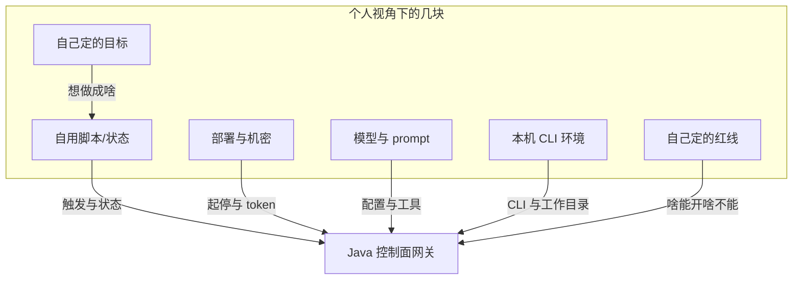
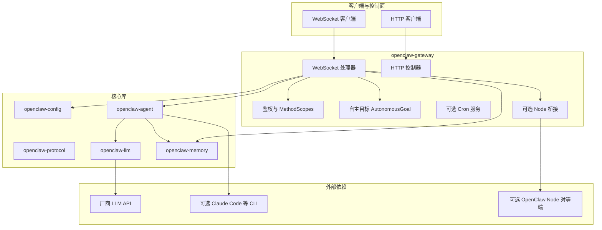

# 手搓一个 Java 版 OpenClaw 控制面：模块怎么拆、先做什么、后做什么

> 这篇是我自己在搬 OpenClaw 网关到 Java 时整理的思路，给同样想「协议对齐、但不一定要 100% 复刻 Node 全家桶」的同学参考。不是官方文档，语气也比较随意。

**为啥是 Java**：说实话，**主要是因为我对 Java 熟**——排障、并发、Spring、Maven 那套不用现学，改网关这种长期要维护的东西，用自己顺手的栈心里踏实。下面 **§1** 里写的全是我**个人为啥要改写、想做成啥样**（多轮、不绑 Node 写代码、独立仓库等），跟**语言选 Java**叠在一起，不是谁替代谁。

**大概会讲到**：网关 / WebSocket / Agent 工具循环、各模块干啥、复杂度体感、推荐迭代顺序，以及**我一个人玩的时候**怎么拆几顶帽子、咋算跑完、进度记在哪。关键词随便记：**网关、JSON-RPC、tool_calls、协议对齐、多轮任务、可观测**。

---

## 1. 为啥要搞 Java 版，我到底想解决啥

### 1.1 现实环境：我手上本来就是 Java 顺手

我自己平时折腾的东西、脚本、小服务，**Java / JVM 这一套最熟**。如果控制面只能跑 Node 网关，就等于**多背一套运行时**：本机或 VPS 上多装一坨、排障路径也不熟，心累。把**跟控制 UI 对齐的那层协议**搬进 JVM，我**维护、打日志、以后想挂定时任务**，都还在自己习惯的栈里转，不用为了助手单独开一条「Node 专线」。

这一段讲的是**环境契合**；它和开头「**熟 Java**」是加成的——**没必要硬啃一坨不熟的 Node 网关源码当日常主业**。**为啥要改写、想加啥能力**（多轮、独立仓库、CLI 写代码等）见后面几小节，不重复展开。

### 1.2 我不满足于「问一句答一句」

上游默认体验很多时候是：来一条消息，模型在有限几轮 tool 里办完，然后收工。**我个人更想要**的是**一件事能拆成多轮**：第一轮改代码，第二轮对着测试日志再修，第三轮只补文档——每轮都要有**能机器读的结论**（比如 `runId`、日志路径、退出码、有没有超时），好让我**自己写的脚本、定时任务或者以后随便啥自动化**决定「要不要再来一轮」，而不是全指望同一段对话上下文**自己记住**。

所以除了协议对齐，还得留**给我自己接自动化用的出口**：持久化一点索引、日志别散在 stdout 里找不到。

### 1.3 写代码这块：我不想绑死 Node 网关 / OpenClaw Node

在 Java 里完整复刻 pi 那套 read/grep/apply_patch，工程量不小。**我希望**在**不依赖 Node 版 OpenClaw、也不强制连 OpenClaw Node 设备**的前提下，还能改自己仓库。我做的折中是：网关在**受控条件下**起子进程，调本机装的 **Claude Code CLI**（`claude --print ...`），`workdir` 锁在配置的 workspace 根下面，跑完把 **runId / logPath / exitCode** 吐成 JSON，**给我自己的脚本或记录用**。这样**对话用哪家 LLM** 和**写代码走哪家 CLI** 可以拆开；CLI 那边该登录该订阅，按 Anthropic 规矩来。

### 1.4 仓库想单独维护，契约别靠肉眼对网页

Java 实现可能会长期放在一个**独立仓库**里，不跟上游 monorepo 绑死。怕协议漂移，就把跟 Node 桥接相关的一小段 TS **vendor 快照**拷进来，配个脚本从本机上游路径同步——**只当参考书**，构建不依赖 Node。谁升级上游，跑一下脚本对一下 diff，心里踏实点。

### 1.5 这篇笔记想回答的问题

说白了：**不全量抄 Node，怎么在 Java 里弄出一个我自己用得动的控制面？** 哪些必须先有，哪些可以后补，边界和安全怎么划。下面先啰嗦完背景，再按模块拆。

### 1.6 一个人也要分清楚几件事：盯着跑、咋算过、进度记哪

一旦有多轮任务、再叠加子进程写代码，控制面就不只是「模型调工具」了。就算**没有公司、没有团队**，我也得自己想清楚：**啥情况下允许调高危能力、出事怎么翻日志、怎样算这轮算完、我自己怎么知道跑到哪了**。下面按**几顶帽子**拆——都是**同一个人**可以轮流戴的，只是别糊成一锅。

**我心里的几顶帽子（全是我一个人也行）。**

1. **定目标的**：这轮想做成啥、先干啥后干啥；密钥别乱晒。  
2. **写脚本/管状态的**：要不要下一轮、读 `runId` 和退出码；重试几次自己心里要有数。  
3. **管进程的**：Java 网关怎么起、监听哪、token 放哪；挂了谁来看日志——还是自己。  
4. **调模型的**：`llm.config`、开不开哪个 tool、反思开几轮——**账单是自己的**。  
5. **管本机代码环境的**：`OPENCLAW_WORKSPACE_ROOT`、目录权限、Claude CLI 装没装、登没登录。  
6. **给自己划红线的**：子进程敢不敢开、日志留多久、东西能不能出网——**自己给自己定规矩**。

拆开想一遍的目的：**别同一脑壳里又想要方便又不想留痕**，后面翻账翻不动。

**图 2** 画了个示意（不是部署拓扑），**个人视角下**几块事和网关咋接上：

**怎么盯着跑。** 技术上靠 **MethodScopes**、连接鉴权、**workspace 只能在内**；子进程必须**超时 + 可 kill**，别跑飞。想严一点就**只给自己留开关**：例如默认关掉 `claude_task`，要用再开。trace 和**每次运行的日志路径**要能事后翻出来对账，别只剩模型一句「我改好了」。

**咋算过。** 别只看模型自嗨。我习惯三层：**自动化**（退出码、自己约定的测试命令、静态检查、diff 别大得太离谱）、**模型辅助**（反思一轮当 lint）、**自己肉眼看**（该看 diff 还得看）。标准可以写在自己**笔记或脚本注释**里，**标个日期/版本**，过两个月自己还记得当时啥标准。

**进度记哪。** trace、JSONL 索引、cron 触发了啥，**跟网关日志能用一个 ID 串起来**就行。若要推到自己别的东西上——Webhook、飞书机器人、个人看板、甚至另一个小脚本——字段有：**任务名（自己起的）、阶段、最近一轮 `runId`、退出码/超时、时间戳、错误摘要**就够了。重试策略**别写死在网关 if-else**，放我自己脚本里更灵活。

第一版可以只做一半，但**事件名、索引格式、以后要接回调的话留个配置位**最好先想好，不然以后改客户端烦死。

---

## 2. 这篇里「手搓」指啥

控制面干的事就三块：**长连接 + 鉴权**、**调 LLM 的 HTTP**、**中间会话状态和工具**。OpenClaw 上游把这些都塞在 Node 里，还带一堆渠道和桌面。我这边**没必要全抄**，把协议和行为对齐到「控制 UI 不懵逼」就够用；多轮编排主要跟**我自己写的脚本或小调度**接。

「手搓」就是：**核心路径自己写清楚**，不靠 JVM 里再套一层黑盒 Node，也不去蹭未文档化的私有接口。目标跟写个**能对照测试的中间件**差不多：模块边界清楚，依赖能列出来，关键行为能跟上游对表。

---

## 3. 对齐啥、最小要长啥样

### 3.1 跟上游对表时盯啥

定一个上游版本或 commit，对着看：**WebSocket 帧、错误码、方法名、MethodScopes**、配置路径（`~/.openclaw`、JSON5、`${ENV}`）、以及 Agent 那边 **tool 多轮怎么转**。Java 侧**不必**把 Telegram 之类渠道全做了，但文档里写清楚**哪些已实现、哪些是 stub**，不然控制端以为能用其实 501。

### 3.2 最小可用长这样

- HTTP：健康检查、就绪，跟上游语义差不多。  
- WebSocket：JSON-RPC 那套 request/response + 一部分 event。  
- 会话：transcript + trace（内存先顶着也行）。  
- LLM：OpenAI 兼容 `chat/completions` + `tool_calls` 循环。  
- 可选：SQLite 记忆、cron、把重活丢给 CLI 或 Node 对等端。  
- 若要接自己的自动化：trace / 索引 / 回调里**字段名和阶段语义**先想清楚（见 1.6）。
- **自主目标（Autonomous Goal）**：持久化「一条业务目标」+ JSONL 进度事件 + 与 `chat.send` 的 `runId` 关联，见 **§3.5**。

### 3.3 基于我的目的：哪些自己撸，哪些接现成的

按我前面说的目标（**熟 Java、协议对齐、多轮可编排、写代码不绑 Node 网关、仓库能单飞**），大致这么划：

**值得自己写、也绕不开的（和「控制面是不是你的」强相关）**

- **网关协议与 WS 方法分发**：帧长啥样、scope 咋校验，不对齐控制 UI 就白干。  
- **`chat.send` → LLM → tool 多轮闭环**：`AgentTurnRunner` 这一条链，决定助手「能不能稳定干活」。  
- **会话里的 transcript / trace**：至少先内存版，后面要不要持久化、多实例，再迭代。  
- **配置路径与 JSON5**：跟上游 `~/.openclaw` 语义对齐，否则和 Node 混用同一台机会懵。  
- **我个人要的调度挂钩**：例如 `claude_task` 跑完写 **runId / logPath / exitCode**、JSONL 索引——这是**我的需求**，不是上游标配，得自己接在网关或工具里。  
- **Memory 存取逻辑**：见 **§3.4**，这块是 Java 侧**按自己约束改过一版的**，不是简单 copy Node。

**直接接现成、不重复造轮子的**

- **对话模型**：任意 **OpenAI 兼容 Chat Completions** 厂商，我只写 HTTP 客户端，不训模型。  
- **向量嵌入**：配好 **`OPENCLAW_EMBEDDINGS_URL`**（及 key、model），走标准 **embeddings HTTP**；不在 JVM 里算 embedding。  
- **SQLite**：用 **sqlite-jdbc**，表结构自己建，但引擎是现成的。  
- **Spring Boot / Jackson**：装配和 JSON，常规栈。  
- **写仓库的「重活」**：**Claude Code CLI**（或别的 CLI）子进程，我不在 Java 里复刻 pi 全套 read/apply_patch。  
- **控制 UI**：只要协议对齐，继续用上游 Web 控制端即可，不必自己画一套。  
- **契约参照**：`vendor/openclaw-node-ref` 里 TS **只当说明书**，不引入 Node 运行时。  
- **可选 OpenClaw Node**：`node.invoke` **队列协议**我在网关里实现；**真正执行命令**的是连上来的对等端，也不是我重写一个 Node。

一句话：**协议、会话、工具循环、个人要的索引与 cron 语义**——自己掌控；**模型推理、嵌入 API、DB 引擎、编码 CLI、UI**——能买（用）就买（用）。

### 3.4 记忆（memory）模块：我这边相对上游动了啥

上游 Node 侧记忆是一整套；Java 里 `openclaw-memory` 是我**按「单机 SQLite + 可选向量」**收敛过一版的，和「完全照搬」有差别，值得单独记一笔。

**存放形态**

- 每个 **`agentId` 一个库文件**：`${OPENCLAW_STATE_DIR}/memory/{agentId}.sqlite`（`agentId` 会做安全字符限制）。  
- 文本按**固定块**切开再入库：**目标块长约 800 字、块之间重叠约 100 字**（常量写在代码里，以后要调也算「改造点」）。单篇内容有**总长度上限**（太大直接拒，避免一条把库撑爆）。

**写入（`put`）**

- 同一逻辑 `path` 再写会先删掉旧 chunk 和对应向量行，再插入新块。  
- **没配嵌入 URL**：只写 `memory_chunks` 表，搜索走 **LIKE**。  
- **配了 `OPENCLAW_EMBEDDINGS_URL`**（可选 key、model）：对每个 chunk 调 **OpenAI 兼容 `POST .../embeddings`**，向量 **L2 归一化**后打成 **float 二进制（BLOB）** 进 `memory_chunk_vectors`；嵌入失败时**不阻断整次 put** 的语义要以当前实现为准（一般优先保证文本落库）。

**搜索（`search`）**

- **基线**：**SQL LIKE** 在内容上捞一批。  
- **开了嵌入**：先从 LIKE 结果里取**最多约 120 条**当候选池，再对每条有向量的 chunk 算与查询向量的**余弦相似度**，按分数重排返回——等于 **「LIKE 召回 + 向量重排」**，**不依赖 sqlite-vec 等原生扩展**，纯 JDBC + 自己算 cosine。  
- 查询太长也会截断/限制，和写入上限是一类「自保」逻辑。

**和 Node 的意图关系**

- **布局上**对齐「按 agent 分库、chunk、可挂向量」这类思路；**实现上**刻意**不绑 sqlite-vec**，方便我这种只想用纯 Java + 远程 embedding 部署的人。  
- 网关里在 **`GatewayBeanConfig`** 一类地方：若环境变量把 embeddings URL 配好了，就给 `SqliteMemoryStore` 塞一个 **`HttpEmbeddingClient`**，否则传 `null` 走纯 LIKE。

**我以后还可能改的点（算改造 backlog）**

- 块长、重叠、LIKE 候选池大小、总字符上限——都和产品体感、账单相关。  
- 嵌入挂了是否要强失败、是否要做异步索引、要不要多租户隔离——看我自己要不要上强度。

下面 §4.4 只作模块定位，**细节以本节为准**。

### 3.5 自主目标（Autonomous Goal）：角色分工、监督、评估、进度在实现上怎么落

**要解决的心智问题**：不想停留在「用户问一句、模型答一句」时，需要把**同一条业务目标**跨多轮对话、多次工具调用、甚至外部 cron/脚本**串成可监督的状态机**。文档里「几顶帽子」在工程上要落成：**阶段（phase）**、**可机读的计划/验收（plan / acceptanceCriteria / lastEvaluation）**、**只追加的进度日志（JSONL）**、以及**和控制面同协议的查询/上报（WebSocket 方法 + `autonomous.goal` 事件）**。

**数据模型（磁盘）**

- 目录：`${OPENCLAW_STATE_DIR}/java-gateway/autonomous-goals/`。
- **主档** `<goalId>.json`：`id`、`title`、`objective`、`acceptanceCriteria`、`phase`（枚举名）、可选 `plan`（自由 JSON 对象，例如 `steps`、角色说明、工具策略提示）、`lastEvaluation`（最近一次评估/审核摘要）、可选 `linkedSessionKey`、`createdAtMs` / `updatedAtMs`。
- **事件流** `<goalId>.events.jsonl`：每行一个 JSON，`{ "ts", "type", "payload?" }`，只追加不写回，方便 `tail` 和外部 ETL。

**阶段枚举（默认由调用方/模型通过 `autonomous.goals.patch` 推进）**

- `INTAKE` → `PLANNING` → `EXECUTING` → `EVALUATING` → `REVIEWING` → `ITERATING`（可回到 `EXECUTING`）→ `DONE` / `FAILED`。
- 「角色分工」**不强制**多进程：在实现上是 **同一 LLM 在不同 phase 使用不同 system 附加说明或不同 tool 白名单**（由你在上层编排脚本或下一轮 `chat.send` 的 prompt 决定）；网关只保证 **phase 与事件可追溯**。

**WebSocket 方法（与 MethodScopes 对齐）**

- **读**：`autonomous.goals.get`（`id`，可选 `eventLimit`）、`autonomous.goals.list`（摘要列表）。
- **写**：`autonomous.goals.create`（至少 `title`，可选 `objective` / `acceptanceCriteria` / `plan`）、`autonomous.goals.patch`（更新 phase、plan、`lastEvaluation` 等）。
- **事件**：服务端在目标相关进度时广播 **`autonomous.goal`**（payload 含 `goalId`、`type`、`ts`、可选 `payload`），与 `chat` 事件并列，控制端可订阅。

**与 `chat.send` 的挂钩（监督执行 / 进度上报）**

- 请求里带 **`autonomousGoalId`**（兼容别名 **`autonomousTaskId`**）且与本次 **`runId`（idempotencyKey）** 一起使用时，网关在每轮 LLM 回合边界写 JSONL 并可选广播事件：
  - `round.start`：用户预览、`sessionKey`、`runId`；
  - `round.complete`：助手预览、`assistantSeq`、`runId`；
  - `round.error` / `round.aborted`：错误摘要或中止。
- 这样 **「一问一答」之上**仍保留会话 transcript，同时 **另一条时间线**按 goal 聚合，便于脚本判断「要不要再来一轮」而不过度依赖模型上下文记忆。
- **评估标准**：`acceptanceCriteria` + `lastEvaluation` 由你或模型写入 `patch`；自动化侧可用 `EVALUATING` 阶段跑测试命令，再把结构化结果写回 `lastEvaluation`（网关不替你执行测试，只存证）。

**和现有能力的关系**

- **`reflectionRounds`**：仍是「单轮回复内的自我修订」；自主目标是 **跨轮** 的壳。
- **`claude_task`**：继续产出 `runId` / logPath / exitCode；可在后续迭代里把 `autonomousGoalId` 透传到工具参数，让 CLI 跑完写 `tool.claude_task` 类事件（当前最小实现以 `chat.send` 边界事件为主）。
- **Memory / trace**：记忆检索仍按 `agentId`+会话；自主目标索引独立，避免和 transcript 混在同一结构里不好做批处理。

**迭代顺序建议**

1. 先用 `create` + `chat.send` 带 `autonomousGoalId` 跑通 JSONL 与 `autonomous.goal` 事件。  
2. 外层脚本读 `get` / `list` + tail JSONL，决定下一 phase 或是否再 `chat.send`。  
3. 再在 prompt 层把 phase 映射到「规划/执行/审核」提示词与工具策略。  
4. 最后按需把 `claude_task`、cron、Webhook 接到同一 `goalId` 上。

---

## 4. 模块拆开长啥样、哪块费脑子

工程上是多模块 Maven，测起来清爽一点。

**图 1** 组件关系示意。

### 4.1 `openclaw-protocol`

就是 DTO + 错误结构，跟上游 `ErrorCodes` / `ErrorShape` 对齐。字段名别瞎改，控制端很敏感。新方法记得加 scope。复杂度**低**，用单测把 JSON 样例钉死。

### 4.2 `openclaw-config`

状态目录、配置文件路径、JSON5、合并、`$include`、`${ENV}`。坑在**路径**：本机 home、容器挂载、Windows，和上游差一点就会「同一台机器 Node 和 Java 读出来不是一回事」。复杂度**中等**，最好有集成测试或快照。

### 4.3 `openclaw-llm`

调 OpenAI 兼容 Chat Completions，把 `tool_calls` 解析出来丢回 Agent。各家错误格式、限流不一样，建议在客户端**统一收成可打日志的结构**。复杂度**低到中**。

### 4.4 `openclaw-memory`

**职责一句话**：按 `agentId` 分 SQLite 文件，chunk + 可选远程 embedding，**LIKE 召回 + 余弦重排**（无原生向量扩展）。**实现上我改过啥、环境变量咋配**，都在 **§3.4** 写过了，这里不重复。复杂度**中等**，数据大了记得自己压测。

### 4.5 `openclaw-agent`

工具注册表、拼 `tools[]`、跑多轮 tool loop、打 trace。注意：`llm.config` 里合并进来的 tool **名字必须在 registry 里有实现**，否则模型会收到 `unknown_tool`，**自己 README 里记一句**。反思轮次、最大 tool 轮数**直接关联账单和延迟**。复杂度**中等**，边界情况多。

### 4.6 `openclaw-gateway`

Spring Boot 装一堆 bean：WebSocket 分发、HTTP、鉴权、cron、可选 Node 桥接、`claude_task` 这种子进程工具。

- **鉴权**：`MethodScopes` 对不齐的话，表现就是「有的方法悄悄失败」，排查很烦。  
- **会话**：内存好开发；以后要**长期跑、多实例**再头疼。  
- **node.invoke**：这是**协议侧队列**，真正干活的是连上来的 **OpenClaw Node**，跟「本机装没装 node」不是一回事。  
- **不绑 Node 写代码**：子进程调 `claude`，workspace 锁死，日志 + JSONL 索引**给我自己的记录/脚本用**。

这块**最费时间**：方法多、跟客户端耦合紧，只能分期做。

### 4.7 插件

`ServiceLoader` 那套可以后做，插件一多边界就糊。

---

## 5. 主路径数据流（顺带提一嘴和自建自动化对齐）

一条 `chat.send` 大致是：

1. 客户端带上 session、模型配置、可选 tools。  
2. 网关拼消息列表，合并内置 tool 和用户配的。  
3. `openclaw-llm` 打厂商；有 `tool_calls` 就 `openclaw-agent` 执行，结果塞回 `role=tool`。  
4. 转到模型不出 tool 或轮次砍死。  
5. 最终 assistant 文本进 transcript，中间过程进 trace / event。

跟上游 Node **协议上像一家**，**运行时和能力集**可以不一样。

如果还要接 1.6 那套**自己定的规矩**：**`runId` / `exitCode` / `logPath`、trace 里的阶段名、Webhook 的 JSON**，最好用**同一套 task id**，别让网关再维护一套和我脚本对不上的状态。

---

## 6. 复杂度体感（踩坑预警）

| 层级 | 内容 | 我担心的点 |
|------|------|------------|
| L1 | 协议、健康检查 | 客户端升级了你没跟 |
| L2 | 配置 | 环境一换配置「看起来一样其实不一样」 |
| L3 | 单次对话无 tool | key 泄露、账单 |
| L4 | 多轮 tool | 工具安全、unknown_tool |
| L5 | 一堆 WS 方法 | 方法爆炸、回归测不动 |
| L6 | 记忆 + 向量 | 一致性、慢 |
| L7 | Cron、CLI、Node 桥 | 路径逃逸、超时、把机器打满 |
| L8 | 自己定的规矩、上报 | 标准没写清、回调挂了**自己都不知道** |

---

## 7. 如果让我排期，我会怎么分期

按我自己精力裁剪，这是我心里的顺序：

**A：能 demo**  
协议 + 配置路径 + HTTP 健康 + WS 连上 + 鉴权骨架，对话先别带 tool 或只带固定的。

**B：真能当助手用**  
`chat.send` + `AgentTurnRunner`，echo、记忆之类安全工具，`llm.config.set`、工具合并，trace 先打起来。

**C：控制 UI 别骂娘**  
WS 方法补到 UI 需要的子集，跟上游行为拉个对照表做回归。

**D：扩展和长期跑**  
Cron、Node 桥、CLI 工具、插件——**上之前想清楚超时和资源**。如果 1.6 那几顶帽子**我自己想清楚了**，这期把**索引格式、trace 字段、高危 tool 开不开**至少落一版能用的。

**E：跟上游 1:1**  
全渠道全插件那种，老实说我不会在手搓里追求；要么接上游要么拆服务。

---

## 8. 自己写一版 vs 直接部署上游 Node

**爽的点**

1. **全在我熟的 Java 栈里**，构建、跑、排障都顺手。  
2. 多轮任务、小脚本、以后想接啥通知，**自己仓库自己改**；不用 fork 一大坨 Node。  
3. 不需要的渠道、高危能力默认关掉，**自己心里有数**。  
4. 代码在自己仓库里，**以后翻旧账、给别人讲一遍**，都看得见。  
5. vendor 快照 + 契约测试，独立仓库也能**慢慢跟**上游，不用绑死发版节奏。

**烦的点**

1. 上游新东西你得自己跟。  
2. pi 级全工具链要么自己写要么 CLI 外包，没有免费午餐。  
3. 契约测试不维护，就会出现「UI 以为能用其实语义偏了」的幽灵 bug。

---

## 9. 收尾几句

Java 手搓一版跟 OpenClaw 对齐的控制面，**可行**，结构也清晰：协议 + 配置打底，LLM + Agent 当心脏，gateway 扛方法面和集成。真正费时间的是 **gateway 又宽又危险**，不是某个算法多难。多轮任务、自己想记的进度、1.6 那几顶帽子**最好一开始就想好数据长啥样**，别等以后硬加字段。

外部 CLI、OpenClaw Node 都是**选项**，不是必选项；**按我自己要不要用选就行**。

---

## 10. 参考与仓库里对应哪

1. OpenClaw 上游：协议和网关实现，自己 pin 一个版本跟。  
2. OpenAI Chat Completions / function calling 文档：tool 消息格式。  
3. 我这份 Java 代码在 `openclaw-java/`，说明看 `README.md`、`docs/node-capabilities.md`，vendor 在 `vendor/openclaw-node-ref/`。编码技能见 `skills/claude-code-task/SKILL.md`。

**图 1、图 2** 是 Mermaid，要交材料的话用 `mermaid-cli` 或自己重画一版矢量图即可。

---

*备注：不涉及真实密钥、内网拓扑或他人业务数据。要是有人要英文版，自己翻译一版结论不变就行。*
